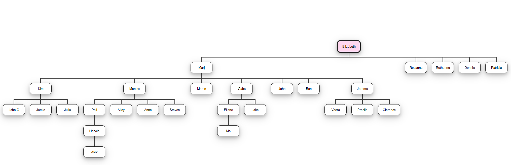

### Family Tree Algorithm Design

The algorithm is being designed for the following problem

> Given any two members in a family tree display the relationship of the first person to the second person.  Ie. George is the great grandparent of Stephen; or Jackson is the child of Emily.

The family tree I will use to test my algorithm is below

Please note this family tree does not have both parents, which will actually help my algorithm as you will soon see. It turns out there is already a data type in computer science called a tree, and it has many applications. Each person in the tree is called a node, and ever child node has to have a parent node. Below is an example of a tree from wikipedia

.svg.png)

The connection between the nodes in the tree above are different from the family tree. The family tree has a sibship line for each generation where ever child is connected to their siblings and parents. In the unsorted tree however the child node is connected only to the parent node. The child nodes are not connected to one another, so to tell if they are siblings you have to look at the parent then look at the children of the parents.

For the setup of my program I will create a tree structure of the family tree example. Programming languages often have tree data structure already made such as python, but you could create your own tree by making an object for each node, and each connection.

Below is the visual representation of how the example family tree will be represented in code. It is essentially the same family tree as the first example, but the siblings are not connected.

