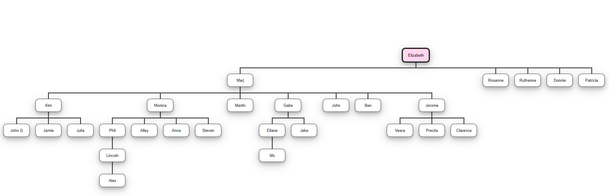
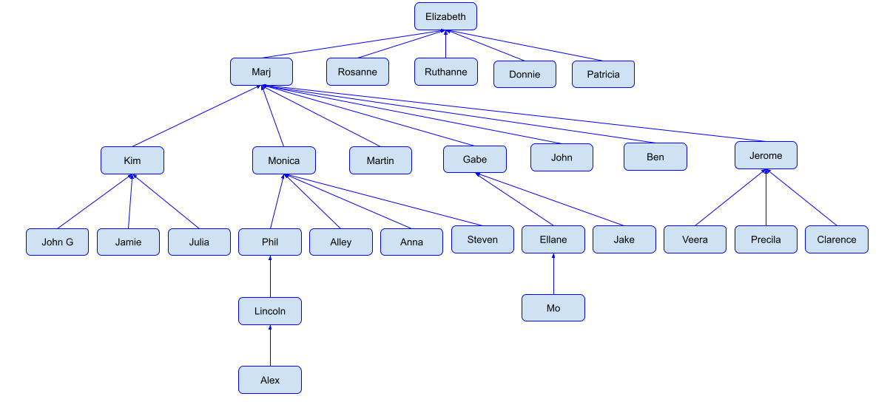
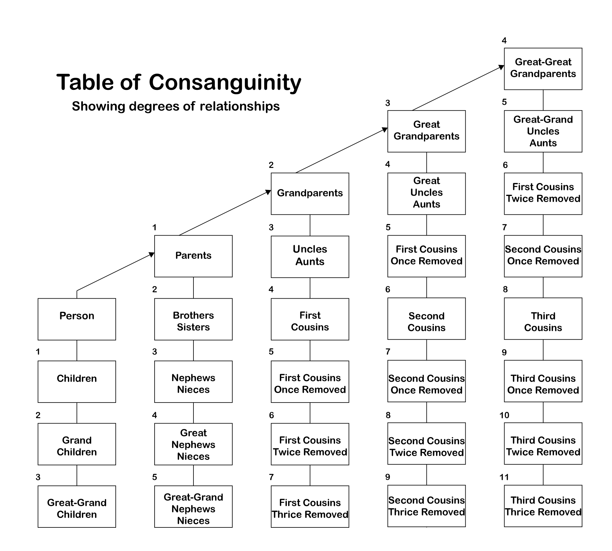

### Family Tree Algorithm Design

The algorithm is being designed for the following problem:

> Given any two members in a family tree display the relationship of the first person to the second person.  Ie. George is the great grandparent of Stephen; or Jackson is the child of Emily.

The family tree I will use to test my algorithm is below.

## Algorithm 1 Tree Approach

Please note this family tree does not have both parents, which will actually help my algorithm as you will soon see. It turns out there is already a data type in computer science called a tree, and it has many applications. Each person in the tree is called a node, and ever child node has to have a parent node. Below is an example of a tree from wikipedia.

.svg.png)

The connection between the nodes in the tree above are different from the family tree. The family tree has a sibship line for each generation where ever child is connected to their siblings and parents. In the unsorted tree however the child node is connected only to the parent node. The child nodes are not connected to one another, so to tell if they are siblings you have to look at the parent then look at the children of the parents.

For the setup of my program I will create a tree structure of the family tree example. Programming languages often have tree data structure already made such as python, but you could create your own tree by making an object for each node, and each connection. You can also create a tree using various other methods such as arrays.

Below is the visual representation of how the example family tree will be represented in code. It is essentially the same family tree as the first example, but the siblings are not connected.

Now that the family structure of the tree is clearly defined, I have to create the algorithm that finds the relation between two nodes in the tree. The actually physical connection between two people can be determined by finding the path between two nodes on a tree. For example the path between Phil and Clarence would be:

Phil &rarr; Monica &rarr; Marj &rarr; Jerome &rarr; Clarence

To figure out the path between two people in the tree I have devised and algorithm. For the algorithm you first need the root, person A and person B. If the root in the tree is not known then it can be found going up the tree from person A or person B until you find the person who has no parents. The root in the example family tree is Elizabeth

Knowing the path between the two people is the actual connection, but it does not tell us how these people are related. For example we do not know if Phil is the father of Monica or Monica is the mother of Phil, we just know they are connected. To actually figure this out we can count the number of ups and downs in the path of the tree. This information can be used in the consanguinity table below:

To figure out the number of ups and downs I will assign a generation number to each person. For example Elizabeth is generation 1 and Marj is generation 2.

Phil &rarr; Monica &rarr; Marj &rarr; Jerome &rarr; Clarence

For example From Phil to Clarence its two ups and two downs, so based on the table they are first cousins.

Here is the pseudocode for the path finding algorithm:

~~~

~~~

## Algorithm 2 Graph Approach

Another approach to solving this algorithm is to create a graph of the family tree rather than the tree. A tree is actually just a special type of a graph. In this algorithm each person node in the family tree knows their parents and thier children. This is different from the previous tree algorithm where every t

Here are the sources I gathered my information from:
https://en.wikipedia.org/wiki/Consanguinity
https://en.wikipedia.org/wiki/Tree_(data_structure)
https://en.wikipedia.org/wiki/Depth-first_search
https://en.wikipedia.org/wiki/Breadth-first_search
https://en.wikipedia.org/wiki/Lowest_common_ancestor
