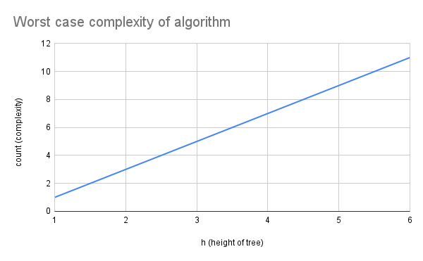

### Family Tree Algorithm Design

The algorithm is being designed for the following problem:

> Given any two members in a family tree display the relationship of the first person to the second person.  Ie. George is the great grandparent of Stephen; or Jackson is the child of Emily.

The family tree I will use to test my algorithm is below.

There are many ways to represent the family tree in code. You could create a graph or a tree or some other data stucture. The way I chose to represent the tree is that there is a person class and each person is given a name, a parent, and a gender. As each person only knows the parent here is what a representation of the tree looks like as it is coded.

Based on tree ever person only knows their parent, which is different from the family tree as each person is connected to thier parents, children, and siblings on the family tree. They are connected via something called a sibship line. I chose to only include the parents of each person as it would be easy to implement rather than something like keeping track of the connection between everyone.

Below is the design of my algorithm explained:

First input the two people you want to find the relationship between (personA and personB). The two people are objects with information like their parents and gender. My algorithm first checks if personA is personB then returns [0,0]. If not the algorithm creates two arrays that each contain personA and personB. Next it checks if the last element in both arrays are equal. If not it pushes the parents of each person to the array. Then it repeats until it is equal. This algorithm works for this particular family tree where it only records one parent, but a different algorithm will need to be created for two parents as it branches. Once the people in both ends of the array are equal then the algorithm checks if each the ends of both arrays are equal. If they are equal then it removes them from the array. Then it repeats until it finds two people that are not equal. It then returns the number of people in both arrays. These numbers are the number of generations from personA to the lowest common ancestor and the number of generations from personB to the lowest common ancestor. These numbers can then be inputted into a consanguity table or algorithm. A trade off is that it has to store two arrays. This algorithm is also does not work for inlaws or multiple parents. Another trade off is that it requires a consainguinity table or seperate algorithm.

Below is the pseudocode for the algorithm

~~~
/* Algorithm #1 Pseudocode

class Person
define attribute name
define attribute parent
define attribute gender
end class

create tree using Person class to make people

function to find number of generations up and down from A to B {
  let personA = person inputted
  let personB = person inputted
  if personA is personB then end loop and return [0 generations up, and 0 generations down]
  let pathA = array with personA
  let pathB = array with personB
  loop forever until told to stop
    let endOfPathA = the last element in pathA
    let endOfPathB = the last element in pathB
    if endOfPathA is equal to endOfPathB {
      loop forever until told to stop {
        let endOfPathA = the last element in pathA
        let endOfPathB = the last element in pathB
        if endOfPathA is not equal to endOfPathB then stop loop
        otherwise remove endOfPathA and endOfPathB from pathA and pathB
      }
     return [the number of elements in pathA, and number of elements in pathB]
     this will be an array that has number of generations up at [0]
     and number of generations down at [1]. This counts from personA to personB on tree. 
     stop loop
    } 
    other wise {
      push the parent of endOfPathA to the end of the pathA array
      push the parent of endOfPathB to the end of the pathB array
    }
}

Input the numberofgenerationsup and numberofgenerationsdown from the function above into a consanguinityTable function
    if numberofgenerationsup is 0 and numberofgenerationsdown is 0 then personA is personB
    if numberofgenerationsup is 0 and numberofgenerationsdown is 1 then personA is the parent of personB
    if numberofgenerationsup is 1 and numberofgenerationsdown is 0 then personA is the child of personB
    if numberofgenerationsup is 1 and numberofgenerationsdown is 1 then personA is the sibling of personB
    etc...
or create an algorithm that does the same thing rather than a table.
*/
~~~

Here is an example of a consanguinity table below.

## Runtime Efficiency/Complexity

If n is the number of people in the family tree then the algorithm has a different run time based on the number of people in the tree and the shape of the paths in the tree. Because my algorithm is based on the parents of each person it only cares about the number of people from personA up to personB, that is to say it only cares about the height of the tree so h is the height of the tree. When I considered a straight line where n is also h, I theorize that the worst case complexity is O(h) = 2h, but because the complexity only cares about the type of growth I can ignore the constant and just say it is O(h) or linear. I say this because in the worst case scenario of a straight line the where personA is the parent of personB the algorithm is set up so they go all the way up before they are equal. This part of the algorithm takes n steps. Then after the path of A and B reach the top, the algorithm goes and removes the people from the array that are the same. In this scenario this takes n steps. 

I determined the graph below by running my program with the following functions and recording the data.

| Height of tree (h) | People inputted      | Count (complexity O(h)) |
| ------------------ | -------------------- | ----------------------- |
| 1                  | Elizabeth, Elizabeth | 1                       |
| 2                  | Elizabeth, Marj      | 3                       |
| 3                  | Marj, Monica         | 5                       |
| 4                  | Monica, Phil         | 7                       |
| 5                  | Phil, Lincoln        | 9                       |
| 6                  | Lincoln, Alex        | 11                      |

The algorithm as it is currently set up relies on a consanguinity table, so there is that limitation. For example you would not be able to run my code in a tree with 1000 generations. To solve this problem I will need to create an algorithm that can add suffixes and prefixes based on the number of generations up and the number of generations down which I certainly believe is possible. This algorithm might have a complexity of its own and will change the current complexity.

Sources
https://en.wikipedia.org/wiki/Consanguinity
